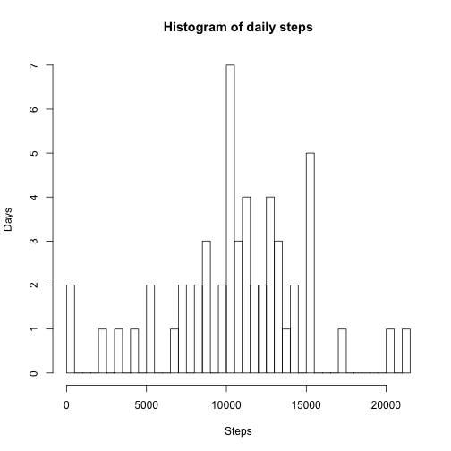
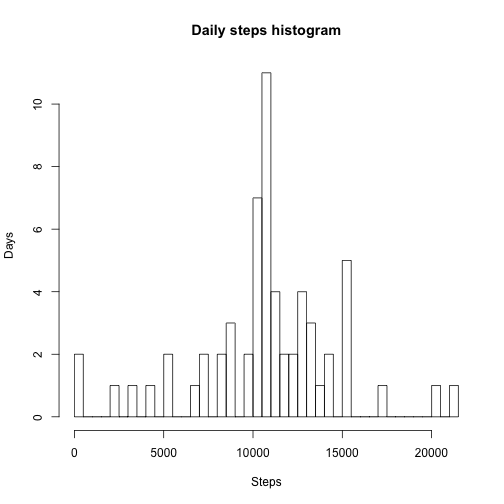
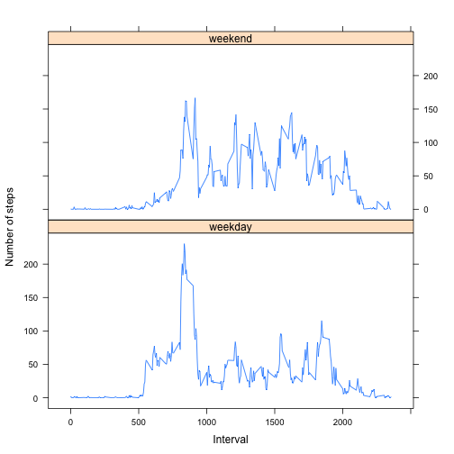

## Loading and preprocessing the data


```r
library(lattice)

options(scipen=1, digits=2)

df <- read.csv(unz("activity.zip", "activity.csv"), colClasses=c('integer', 'Date', 'integer'))
```


## What is mean total number of steps taken per day?


```r
steps_by_day <- aggregate(steps ~ date, data=df, sum)
hist(steps_by_day$steps, breaks=50, xlab = "Steps", ylab = "Days", main = "Histogram of daily steps")
```



```r
steps_mean <- mean(steps_by_day$steps)
steps_median <- median(steps_by_day$steps)
```

Mean and median of the total number of steps taken per day: 10766.19, 10765.

## What is the average daily activity pattern?


```r
steps_by_interval <- aggregate(steps ~ interval, data=df, mean)
plot(steps_by_interval, type="l")
```


```r
maximum_interval_number <- steps_by_interval$interval[which.max(steps_by_interval$steps)]
```

Interval number 835 has maximumum number of steps on average.

## Imputing missing values


```r
incomplete_cases <- !complete.cases(df)
total_incomplete_cases <- sum(incomplete_cases)
```

There are 2304 rows with NAs. Let's fill them with the mean for the corresponding 5-minute interval:


```r
df_im <- df
incomplete <- df_im[incomplete_cases,]
df_im[incomplete_cases,]$steps <- steps_by_interval[match(incomplete$interval, steps_by_interval$interval),]$steps

steps_by_day_im <- aggregate(steps ~ date, data=df_im, sum)
hist(steps_by_day_im$steps, breaks=50, xlab = "Steps", ylab = "Days", main = "Daily steps histogram")
```



```r
steps_mean_im <- mean(steps_by_day_im$steps)
steps_median_im <- median(steps_by_day_im$steps)
```

For imputed data mean and median of the total number of steps taken per day: 10766.19, 10766.19.

The mean is the same as before, the median differs and is now equals to the mean value. The impact of imputing missing values is that highest value in the histogram is now even bigger, that means that all or almost all of imputed values summarized by day hit the same bucket on the histogram.

## Are there differences in activity patterns between weekdays and weekends?


```r
df_im_weekdays <- weekdays(df$date) %in% c("Saturday", "Sunday")
df_im$weekpart <- factor(df_im_weekdays, labels=c("weekday", "weekend"))

steps_by_interval_im <- aggregate(steps ~ interval + weekpart, data=df_im, mean)

xyplot(steps ~ interval | weekpart,
       data = steps_by_interval_im,
       type = "l",
       xlab = "Interval",
       ylab = "Number of steps",
       layout = c(1, 2))
```



